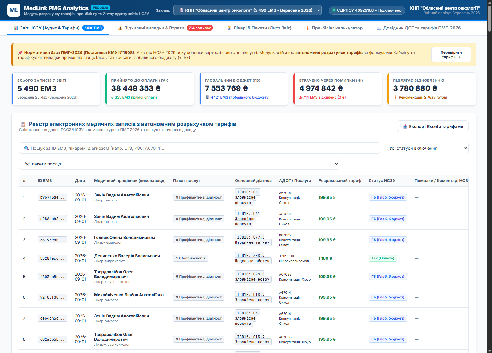
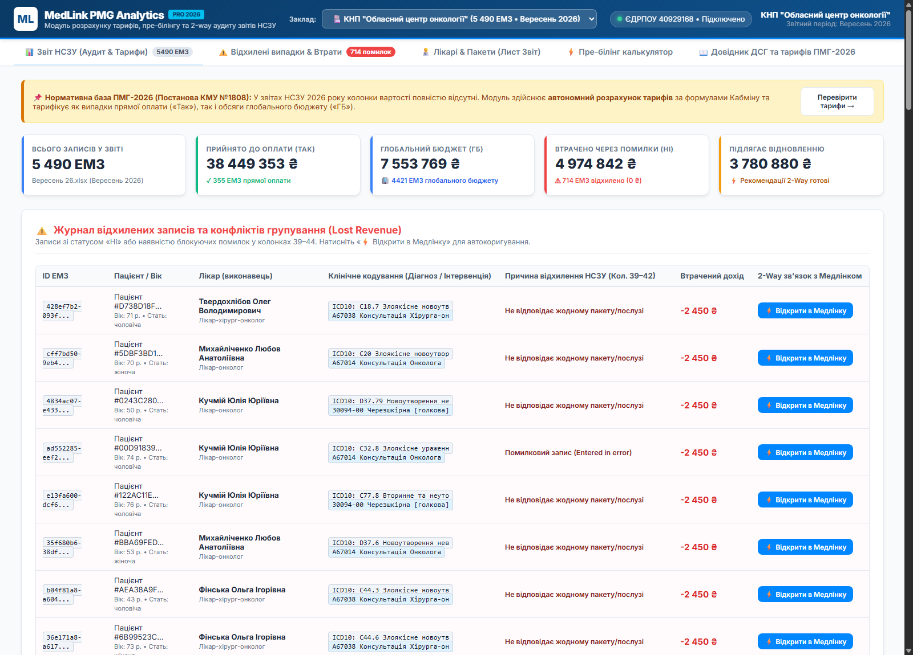
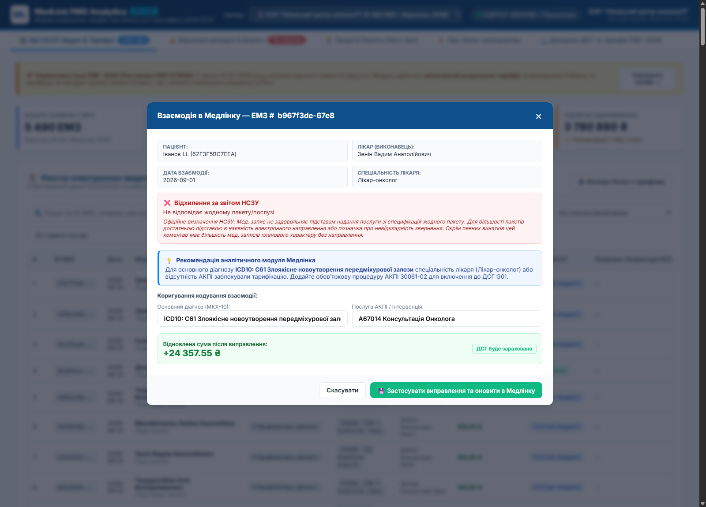
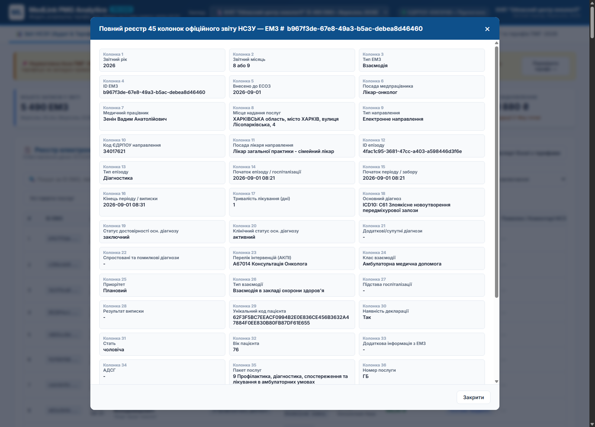
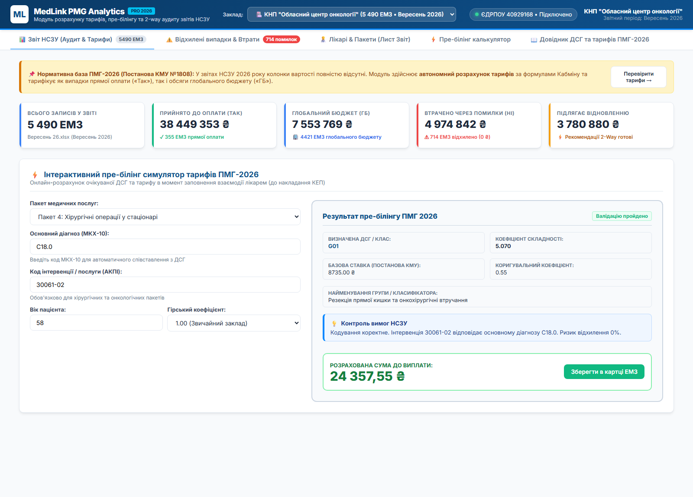
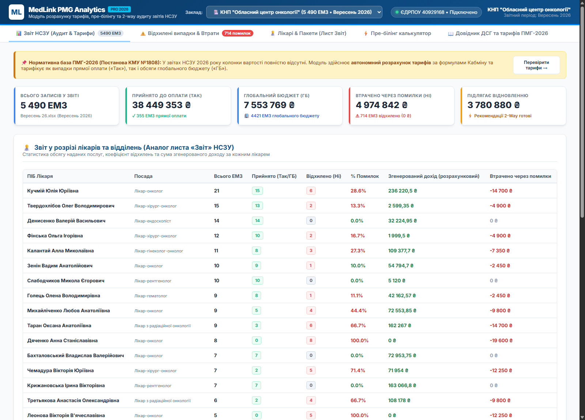
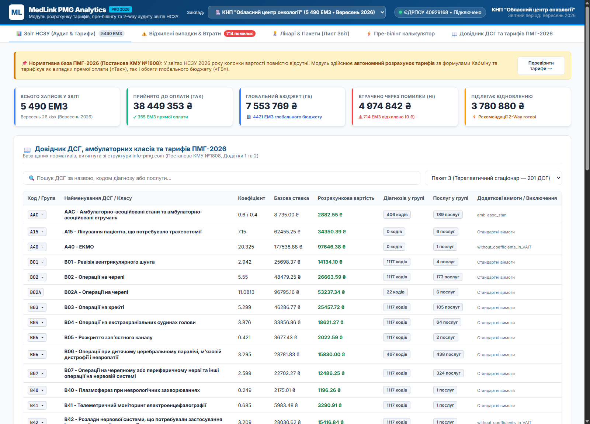
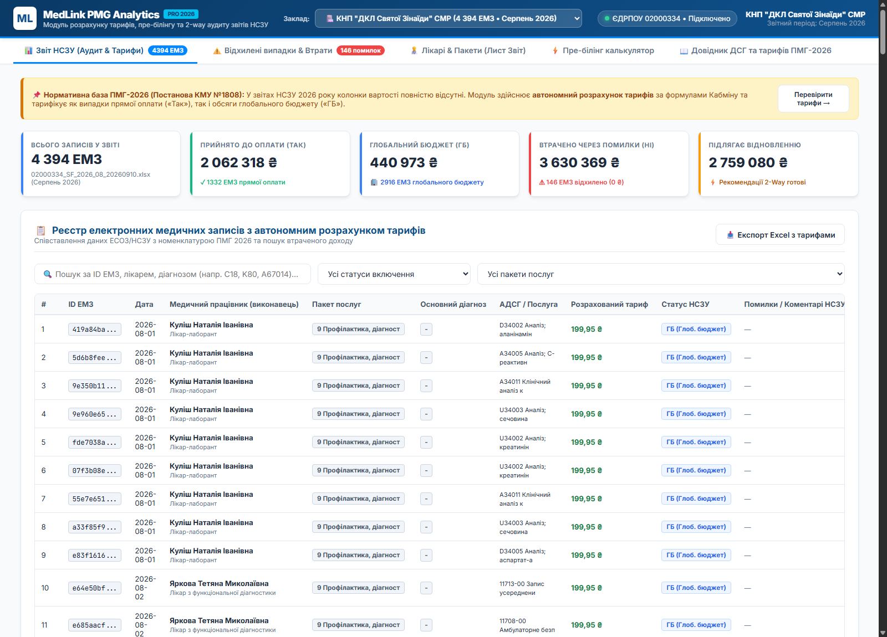

# Посібник користувача прототипу з ілюстраціями та скріншотами

Експериментальний зразок реалізовано у вигляді автономного веб-додатку за адресою:
📂 **[`c:\__MEDLINK___\PMG\prototype\index.html`](file:///c:/__MEDLINK___/PMG/prototype/index.html)**

Додаток працює локально в будь-якому браузері (Chrome, Edge, Firefox) без необхідності підняття серверів чи підключення до Інтернету.

---

## 1. Головний екран: Аудит звіту НСЗУ та автономний розрахунок тарифів

### Елементи управління та показники:
1. **Селектор закладу (в шапці)**:
   - Дозволяє миттєво перемикати контекст між двома реальними лікарнями:
     - *КНП «Обласний центр онкології» (5 490 ЕМЗ • Вересень 2026)*
     - *КНП «ДКЛ Святої Зінаїди» СМР (4 394 ЕМЗ • Серпень 2026)*
   - Автоматично оновлює код ЄДРПОУ, звітний період, повний реєстр та показники KPI.
2. **Блок верхніх KPI-карток**:
   - **Всього записів у звіті**: загальна кількість ЕМЗ за даними НСЗУ.
   - **Прийнято до оплати (Так)**: сума, нарахована за випадками прямої поштучної оплати.
   - **Глобальний бюджет (ГБ)**: розрахована за формулами ПМГ сума наданої допомоги, що зарахована у виконання фіксованої капітаційної ставки.
   - **Втрачено через помилки (Ні)**: прямий недоотриманий дохід лікарні (Lost Revenue) через технічні помилки кодування.
   - **Підлягає відновленню**: сума, яку можна повернути шляхом повторного коректного кодування взаємодій.
3. **Таблиця реєстру ЕМЗ**:
   - Колонка *«Розрахований тариф»*: виводить точну вартість випадку в гривнях (зеленим або червоним).
   - Колонка *«Статус НСЗУ»*: бейджі `Так (Оплата)`, `ГБ (Глоб. бюджет)` або `Ні (Відхилено)`.
   - Кнопка *«📋»*: відкриває повне розгортання всіх 45 колонок офіційного вивантаження НСЗУ.

---

## 2. Журнал відхилених записів та аналіз втраченого доходу (Lost Revenue)

### Функціонал вкладки:
* Відображає виключно ті медичні записи, де НСЗУ встановила статус «Ні» або зафіксувала блокуючі помилки.
* Деталізує причину відхилення з колонок 39–42:
  - *«Взаємодія для МВТН»*
  - *«Не відповідає жодному пакету/послузі»*
  - *«Перекриття – послуги що надані пацієнту протягом одного проміжку часу»*
  - *«Відсутній план лікування»*
* Біля кожного запису виведено суму фінансового збитку (зі знаком мінус).
* Кнопка **«⚡ Відкрити в Медлінку»** активує алгоритм автоматичного підбору виправлення.

---

## 3. Модальне вікно 2-Way коригування взаємодії в Медлінку

### Логіка роботи асистента:
1. За `ID ЕМЗ` система зв'язує запис із пацієнтом та лікарем у МІС «Медлінк».
2. **Офіційне визначення НСЗУ**: підтягується нормативне тлумачення помилки з аркуша «Опис помилок».
3. **Рекомендація модуля**: система аналізує діагноз лікаря і пропонує конкретну дію:
   > *«Для основного діагнозу C61 або C18 спеціальність лікаря або відсутність АКПІ заблокували тарифікацію. Додайте обов'язкову процедуру АКПІ 30061-02 для включення до ДСГ G01»*.
4. **Розрахунок відновленої суми**: показує точний фінансовий приріст після застосування поради (наприклад, **+24 357.55 грн**).
5. Кнопка **«💾 Застосувати виправлення та оновити в Медлінку»**: миттєво оновлює кодування запису, переводить його в статус «Прийнято» та перераховує загальні KPI дашборду.

---

## 4. Повний перегляд 45 колонок офіційного звіту НСЗУ

### Можливості інспектора запису:
* Дозволяє перевірити будь-яку з 45 колонок аркуша «Розшифровка» в структурованому вигляді:
  - Колонки 1–5: Звітний рік, місяць, тип ЕМЗ, UUID, дата внесення до ЕСОЗ.
  - Колонки 6–11: Лікар, виконавець, місце надання, посада лікаря, направлення та ЄДРПОУ направителя.
  - Колонки 12–17: Епізод, тип, дати госпіталізації, виписки, тривалість у днях (LOS).
  - Колонки 18–28: Клінічне кодування, достовірність, супутні діагнози, перелік АКПІ, клас, пріоритет.
  - Колонки 29–36: Хеш пацієнта, декларація, стать, вік, АДСГ, пакет послуг, код послуги.
  - Колонки 37–45: Включення до статистики, включення до звіту, деталі повноти (JSON), коментарі перевірок.

---

## 5. Інтерактивний симулятор пре-білінгу ПМГ-2026

### Сценарій використання лікарем під час прийому:
1. Лікар обирає пакет (наприклад, *Пакет 4: Хірургічні операції у стаціонарі*).
2. Вводить код основного діагнозу (наприклад, `C18.0`) та послугу АКПІ (`30061-02`).
3. Вказує вік пацієнта та коефіцієнт місцевості (звичайний заклад або гірський 1.25).
4. **Результат**:
   - Визначено ДСГ: **G01 (Резекція прямої кишки та онкохірургічні втручання)**.
   - Коефіцієнт складності: **5.070**.
   - Коригувальний коефіцієнт: **0.55**.
   - Розрахована виплата: **24 357.55 грн**.
   - Статус: *«Кодування коректне. Ризик відхилення 0%»*.

---

## 6. Звіт у розрізі лікарів та відділень (Аркуш «Звіт»)

### Аналітичні можливості для керівництва:
* Повна відповідність структурі аркуша «Звіт» офіційного вивантаження НСЗУ.
* Групування статистики за кожним лікарем закладу:
  - Кількість поданих ЕМЗ.
  - Кількість прийнятих послуг («Так» та «ГБ»).
  - Кількість відхилених записів («Ні»).
  - Відсоток браку / помилок лікаря.
  - Сума згенерованого доходу для лікарні.
  - Сума коштів, втрачених через некоректне кодування конкретного спеціаліста.

---

## 7. Пошуковий довідник ДСГ та нормативів ПМГ-2026

### Довідкова база:
* Миттєвий повнотекстовий пошук за 465 ДСГ стаціонару, 148 амбулаторними класами та правилами реабілітації.
* Відображає нормативні коефіцієнти Постанови КМУ №1808, базову ставку, розрахункову вартість, а також кількість включених діагнозів і процедур.

---

## 8. Робота зі звітом дитячої клінічної лікарні (КНП «ДКЛ Святої Зінаїди»)

### Специфіка багатопрофільного дитячого стаціонару:
* 4 394 записи, виражена частка амбулаторної реабілітації (Пакет 54), неонатальної реабілітації (Пакет 25), дитячої стоматології (Пакет 34) та педіатричного стаціонару (Пакет 4).
* Демонструє універсальність розрахункового движка для будь-якого профілю ЛПЗ (від спеціалізованого онкоцентру до міської дитячої лікарні).
